# ADR-002: Hook scoping — singleton ProtocolHook

## Status

Accepted — 2026-04-29 (revisit by 2026-07-28).

## Context

PRISM uses Uniswap V4 hooks for three intrinsic behaviors: dynamic fees
(`beforeSwap`), MEV observation/capture (`afterSwap`), and per-position
state cleanup (`afterAddLiquidity` / `afterRemoveLiquidity`). V4 enforces
hook permissions through the lower 14 bits of the hook *address*: a hook
must be deployed at an address satisfying
`address & 0x3FFF == 0x05C0` for PRISM's permission set, found by CREATE2
salt mining (PRD §Day 4, `HookMiner`).

The open design question gated by this ADR is whether the protocol uses

1. **One singleton `ProtocolHook`** servicing every PRISM vault/pool, with
   per-pool state sharded internally by `PoolId`, **or**
2. **A per-vault hook**, deployed alongside each vault by `VaultFactory`.

The PRD already encodes the singleton shape — `mapping(PoolId => …)` for
volatility state, `mapping(PoolId => address) public vaultByPool` for
vault routing, and `mapping(address => uint256) public mevProfitsAccrued`
keyed by vault address (PRD §Day 4 `ProtocolHook`). This ADR formalises
the choice, makes the rejected alternative explicit, and documents the
blast-radius posture so reviewers and future contributors do not relitigate
the call ad-hoc.

## Decision

PRISM v1 ships a **single, immutable `ProtocolHook`** contract deployed
once at a salt-mined address. Every `Vault` created by `VaultFactory`
attaches that hook via the canonical `PoolKey.hooks` field. Per-pool and
per-vault state is sharded inside the hook by `PoolId` and `address(vault)`.

Concrete implementation constraints flowing from this decision:

1. `VaultFactory.create(PoolKey, IStrategy)` MUST set
   `PoolKey.hooks = address(PROTOCOL_HOOK)` for the singleton instance —
   the address is a constructor immutable on the factory (#31).
2. `ProtocolHook.getHookPermissions()` returns exactly the bits encoded in
   the deployed address (`0x05C0` — bits 6, 7, 8, 10). Bytecode and address
   must match or `PoolManager.initialize` reverts (#34, invariant #7).
3. `afterAddLiquidity` and `afterRemoveLiquidity` MUST be **non-reverting,
   side-effect minimal**: emit-only or pure state cleanup. They live on the
   withdrawal hot path (PRD invariant: *withdraw never reverts when user
   has shares*) and a reverting liquidity callback would brick withdrawals
   for every vault. This is enforced by tests, not by code.
4. State namespacing inside the hook is by `PoolId` (volatility, fee state,
   vault routing) and by `address(vault)` (MEV profit ledger). No global
   mutable state is shared across vaults.
5. The hook is immutable (ADR-006). A bug-fix path is "deploy v2 hook at a
   newly mined address, migrate vaults via the migration playbook" — not
   in-place upgrade.

## Alternatives considered

### A. Per-vault hook (rejected)

Each `VaultFactory.create` mines a salt and deploys a fresh hook alongside
the vault.

| Axis | Per-vault | Singleton | Notes |
|---|---|---|---|
| CREATE2 salt mining cost | **Each deploy** pays ~10⁵ keccak iterations to find a `0x05C0` address (≈ 2–8s offline, but on-chain factory must accept a precomputed salt). | Once at deploy. | Per-vault forces `VaultFactory.create` to take a salt argument and trust the caller — adds permissioned ergonomics or a separate keeper-driven mining service. |
| Audit surface | N copies of the same bytecode → still one audit, but per-deploy verification needed. | One bytecode, one verification. | Etherscan/Sourcify verification per vault is a meaningful operational tax. |
| Client/keeper integration | Must enumerate vaults to discover hook addresses. | One known hook address. | Public ABI export becomes per-vault. |
| Blast radius (bug in hook) | One vault's hook compromised. | All vaults' hooks compromised. | **Strongest argument for per-vault.** See mitigations below. |
| Per-pool isolation of volatility state | Native (separate contract). | Native (mapping by `PoolId`). | No real difference — both achieve isolation. |
| Permission flexibility per vault | Possible (mine different bit pattern). | Uniform `0x05C0`. | PRISM v1 has no use case for varying permissions per vault. |
| Gas — `beforeSwap` / `afterSwap` | One SLOAD to pool-state mapping. | One SLOAD to pool-state mapping (warmer cache from cross-vault traffic). | Negligible; cross-vault traffic actually warms the singleton's storage page. |

The per-vault model trades real, recurring operational cost (mining,
verification, ABI/registry plumbing) for a single-axis isolation gain
(blast radius). Given the mitigations available to the singleton (next
section), the trade is not worth it for v1.

### B. Hook tiers (rejected)

One hook per "vault tier" (e.g. one for stable pairs, one for volatile,
one for exotic). Adds the tiering taxonomy as a permanent governance
surface, multiplies audit cost by tier count, and provides no isolation
benefit unless the tier-defining axis matches the bug class — which it
will not, in the general case. Rejected as premature taxonomy.

## Blast radius — singleton bug analysis

| Bug class | Singleton consequence | Mitigation |
|---|---|---|
| Reverting `beforeSwap` / `afterSwap` | All swaps through PRISM pools fail until redeploy + migration. | (a) `ReentrancyGuardTransient` + CEI prevent the most common revert classes. (b) Slither + Aderyn in CI (#61) catch unchecked-call / overflow patterns. (c) PRD invariant: hook math is bounded (`MIN_FEE`/`MAX_FEE` clamps, `MAX_POSITIONS`). (d) Withdraw path does **not** depend on `beforeSwap`/`afterSwap`. |
| Reverting `afterAddLiquidity` / `afterRemoveLiquidity` | **Withdraws and rebalances brick across all vaults.** | Hard rule (decision §3 above): these callbacks MUST NOT revert. Enforced by tests `invariant_withdrawAlwaysSucceeds` (PRD §Day 4) and unit reverts on any hook code path that throws inside a liquidity callback. |
| Mispriced dynamic fee (math bug) | All pools use a wrong fee; protocol revenue/UX harmed but no fund loss. | (a) Clamp invariants `MIN_FEE ≤ fee ≤ MAX_FEE`. (b) Fee is a UX/economics issue, not a custody issue — fixed by hook v2 + migration. |
| MEV ledger corruption | `mevProfitsAccrued[vault]` non-monotonic or wrong. | (a) Invariant #5 (monotonic non-decreasing) under fuzz. (b) MEV profits are protocol revenue, not user funds — capped blast radius. |
| Permission/address mismatch | `PoolManager.initialize` reverts at first vault creation; protocol cannot launch. | Caught at deploy time, not at runtime. Verification script (`scripts/verify-hook.ts`) asserts `address & 0x3FFF == permissions` post-deploy. |
| Reentrancy through hook callback | Cross-vault drain. | (a) `ReentrancyGuardTransient` (EIP-1153) on every vault entry point. (b) `onlyPoolManager` on every hook callback. (c) Strict CEI ordering. (d) Invariant #4 (zero-delta settlement) makes drain attempts visible. |
| Oracle dependency for `afterSwap` MEV check | Stale Chainlink → MEV decisions wrong. | (a) `ChainlinkAdapter` staleness gate (>1h) disables MEV capture, does not revert (ADR-003). (b) `afterSwap` returns ZERO_DELTA on staleness — pool keeps functioning. |

**Custody-free posture holds under all classes**: no admin keys on user
funds, withdraw never depends on hook math, and the worst hook-triggered
outcome for users is "deposit/rebalance temporarily unavailable". This
matches PRISM's invariant 6 (*Withdrawals never pausable*).

## Invariants impacted

- **#4 — PoolManager currency deltas settle to zero within every `unlock`.**
  Singleton hook does not interact with `unlock`; `Vault.deposit` /
  `Vault.withdraw` do. Decision is neutral.
- **#5 — `mevProfitsAccrued[vault]` monotonically non-decreasing until
  explicit claim.** Hook is the sole writer to this mapping; singleton
  must enforce monotonicity uniformly across vaults. Tested per-vault and
  cross-vault.
- **#7 — Hook address bit flags == `getHookPermissions()` exactly.** One
  hook → one verification. Singleton makes this trivially testable at
  deploy time.
- **PRD invariant: withdraw never reverts when user has shares.** Forces
  hard rule §3 above on liquidity callbacks. Singleton concentrates this
  rule into one contract — easier to audit than enforcing it on N hooks.

## Architecture

```mermaid
flowchart LR
    subgraph PRISM["PRISM Protocol"]
        F[VaultFactory<br/>immutable PROTOCOL_HOOK]
        V1[Vault A<br/>USDC/WETH 0.05%]
        V2[Vault B<br/>USDC/WETH 0.30%]
        V3[Vault C<br/>cbBTC/WETH]
        H[ProtocolHook<br/>addr & 0x3FFF == 0x05C0<br/>state by PoolId / vault]
    end
    subgraph V4["Uniswap V4"]
        PM[PoolManager singleton]
    end

    F -->|create &#40;PoolKey, Strategy&#41;| V1
    F -->|create &#40;PoolKey, Strategy&#41;| V2
    F -->|create &#40;PoolKey, Strategy&#41;| V3

    V1 -->|hooks = H| PM
    V2 -->|hooks = H| PM
    V3 -->|hooks = H| PM

    PM -->|beforeSwap / afterSwap<br/>afterAddLiquidity / afterRemoveLiquidity| H
```

## Consequences

**Positive**

- One audit, one verification, one address to track.
- VaultFactory has no salt-mining responsibility — `create` is cheap and
  permissionless.
- Cross-vault MEV ledger is uniform; future v1.1 backrun execution lands
  in one place.
- Hook bytecode is reusable across testnet/mainnet by re-mining the salt
  for the target deployer.

**Negative**

- One hook bug freezes mutating operations across all PRISM vaults until
  hook v2 is deployed and vaults migrated. Withdraws are insulated by the
  non-reverting-callback rule and remain available.
- Migration playbook (ADR-006) must support pointing existing vaults at a
  new hook address — concretely: vaults are immutable too, so "migration"
  means deploying parallel v2 vaults under a v2 hook and offering users a
  withdraw-then-redeposit path. This is the same playbook as a Vault bug.

**Neutral**

- Per-pool storage growth is bounded by the number of vaults; storage cost
  is identical to the per-vault model in aggregate.

## References

- Issue ozpool/prism#9 (this ADR)
- PRD §Day 4 — ProtocolHook implementation (singleton state shape)
- PRD §Invariants 4, 5, 7
- ADR-001 — Solidity compiler version
- ADR-006 — Immutable core v1 (migration playbook) — pending
- Uniswap V4 `Hooks.sol` permission bit layout
