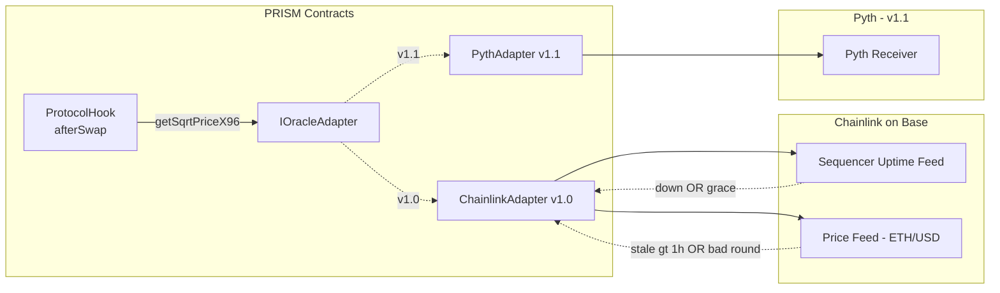
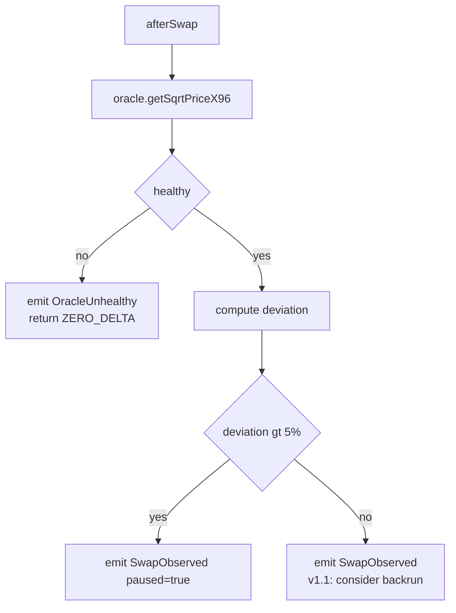

# ADR-003: Oracle strategy

## Status

Accepted — 2026-04-29 (revisit by 2026-07-28).

## Context

PRISM consumes external price information for one purpose only in v1.0:
**MEV observation in `afterSwap`**. The hook reads an external sqrt-price,
compares it to the pool's post-swap sqrt-price, and emits
`SwapObserved(deviation)`. v1.1 adds backrun *execution* on the same
deviation signal, which is when the oracle's accuracy and freshness
become economically load-bearing.

Critically, the oracle is **not** on the deposit, withdraw, or rebalance
path. PRISM invariant — *withdraw never reverts when user has shares* —
forbids any oracle dependency that could brick user fund retrieval. This
ADR encodes that boundary.

The PRD names Chainlink as the primary feed (PRD §Day 4) with a 1h
staleness gate, a 5% deviation threshold for MEV pause, and Pyth/TWAP as
v1.1 successors. The open questions this ADR answers concretely:

1. Why Chainlink over Pyth at v1.0?
2. How does the L2 (Base) sequencer-uptime feed gate the oracle?
3. What does "fail-soft" mean exactly — which contract paths revert vs.
   degrade vs. ignore the failure?
4. What's the v1.1 migration shape, and does it require a hook redeploy?

## Decision

**Primary feed**: Chainlink price feed for the pool's reference asset
(e.g. ETH/USD on Base mainnet, ETH/USD testnet feed on Base Sepolia),
wrapped behind `IOracleAdapter` so the source is swappable.

**Interface** (`packages/contracts/src/interfaces/IOracleAdapter.sol`):

```solidity
interface IOracleAdapter {
    /// Returns the latest external sqrt-price in Q64.96, or marks the
    /// adapter unhealthy. NEVER reverts — `healthy == false` is the
    /// failure signal.
    function getSqrtPriceX96(PoolKey calldata key)
        external view returns (uint160 sqrtPriceX96, bool healthy);
}
```

`ChainlinkAdapter` implements this with the following gates, evaluated in
order:

| # | Gate | Threshold | On fail |
|---|---|---|---|
| 1 | L2 sequencer uptime feed | down OR last-up < `GRACE_PERIOD` (1h) | `healthy = false` |
| 2 | Round staleness | `block.timestamp - updatedAt > STALENESS` (1h) | `healthy = false` |
| 3 | Round answer sanity | `answeredInRound >= roundId` AND `answer > 0` | `healthy = false` |
| 4 | Aggregator address | `latestRoundData()` returns non-zero | reverts adapter only (not hook) |

**Constants** (mainnet — testnet may relax):

| Constant | Value | Source |
|---|---|---|
| `STALENESS` | 3600 s (1h) | Matches Chainlink ETH/USD heartbeat on Base |
| `SEQUENCER_GRACE_PERIOD` | 3600 s (1h) | Chainlink-recommended buffer after sequencer comes back |
| `MEV_DEVIATION_PAUSE` | 5% | PRD §Day 4 (figure 13.1) |
| `MEV_DEVIATION_MIN_FOR_BACKRUN` | TBD v1.1 | Off-scope |

**Hook integration rules** (`ProtocolHook.afterSwap`):

1. Read `(sqrtPx, healthy) = oracle.getSqrtPriceX96(key)`.
2. If `!healthy` → emit `OracleUnhealthy(poolId)`, **return ZERO_DELTA**.
   No revert. MEV capture is paused for this swap.
3. If deviation between pool and oracle > `MEV_DEVIATION_PAUSE` → emit
   `SwapObserved` with `paused=true`, no backrun.
4. Otherwise → emit `SwapObserved`, (v1.1) consider backrun.

**Boundary rule (LOAD-BEARING)**: `Vault.deposit`, `Vault.withdraw`,
`Vault.rebalance` MUST NOT call `IOracleAdapter`. Rebalance triggering is
purely tick-drift / time-based (`IStrategy.shouldRebalance`); deposits and
withdraws use only PoolManager-internal sqrt-price. Oracle failure
degrades MEV capture only, never user funds.

## Alternatives considered

### A. Pyth as primary (rejected for v1.0, accepted for v1.1)

Pyth has lower median latency than Chainlink and rich coverage on Base.
Rejected for v1.0:

- Pyth uses a *pull* model — the user (or hook caller) must pass a signed
  price update payload as calldata. This pushes payload distribution
  responsibility onto the swapper or a relayer, which is incompatible
  with V4's `afterSwap` callback signature. Requires either a held-state
  Pyth wormhole receiver (adds attack surface) or a Pyth Express Relay
  integration (adds operational dependency).
- ETH/USD on Base mainnet: at v1.0 deployment time, Chainlink is the more
  battle-tested feed source on the chain. Pyth coverage is comparable but
  with less L2-specific incident history.
- v1.0 only *observes* MEV; oracle precision pays dividends only at v1.1
  when execution lands.

Accepted for v1.1: deploy `PythAdapter` behind `IOracleAdapter`,
A/B-compare against Chainlink in shadow mode, then promote. Requires a
hook redeploy if the hook stores the adapter address in immutable
storage — see "Migration" below.

### B. Pool TWAP only (rejected)

Use the V4 pool's own observations (TWAP) as the reference. Rejected:

- Manipulating the same pool that grants the reference defeats the
  observation. The TWAP is a smoothed view of the same order flow.
- For PRISM, the oracle's purpose is to detect that the pool has been
  *moved away from* an external truth — TWAP is the wrong instrument.

TWAP is *additive* (composite check), not substitute. Targeted for v1.1.

### C. Composite at v1.0 (Chainlink + Pyth + TWAP) (rejected)

Complexity does not pay off when v1.0 is observe-only. Composite oracle
adds aggregation policy (median, weighted, fallback chain) that becomes
governance surface and audit cost. Bring it in v1.1 alongside execution.

### D. No oracle in v1.0 (rejected)

Skip MEV observation entirely. Rejected: SwapObserved data is needed to
calibrate the v1.1 deviation thresholds with real Base traffic; deferring
the data-collection step delays v1.1 by a calibration cycle.

## L2 sequencer-uptime handling

Base inherits OP-stack sequencer architecture. A sequencer outage causes
Chainlink feeds to *appear* fresh (cached) while the chain itself is not
producing blocks for users. Chainlink publishes a sequencer-uptime
aggregator on Base mainnet
(`0xBCF85224fc0756B9Fa45aA7892530B47e10b6433`). The adapter:

1. Reads the sequencer feed first.
2. If `answer != 0` (sequencer is down) → `healthy = false`.
3. If `answer == 0` AND `block.timestamp - startedAt < GRACE_PERIOD` (the
   sequencer just came back) → `healthy = false` for the grace window.
4. Only after the grace window does the price feed gate apply.

On Base Sepolia the sequencer feed exists at a different address; this is
a deploy-time constant.

## Invariants impacted

- **#5 — `mevProfitsAccrued[vault]` monotonically non-decreasing.**
  Oracle failure → no backrun → no profit accrued → still monotonic.
  Holds.
- **#6 — `sharePrice(t+1) >= sharePrice(t)` under normal operation.**
  Oracle is not on this path. Holds trivially.
- **PRD: withdraw never reverts when user has shares.** The boundary
  rule enforces this — oracle calls are isolated to `afterSwap`.

## Architecture





## Migration to v1.1

Two paths, depending on `ProtocolHook` storage choice:

1. **Mutable adapter slot on hook** — hook holds `IOracleAdapter
   public oracle` as a non-immutable storage variable, settable by a
   timelocked owner (e.g. multisig with 48h delay, same as deposit
   pause). v1.1 just `setOracle(newAdapter)`. Rejected because it adds
   admin surface to user-facing contracts (violates §"Custody-free").
2. **Immutable adapter on hook + redeploy** — hook stores
   `IOracleAdapter public immutable oracle`. v1.1 mines a new hook
   address with the new adapter constructor arg, then migrates vaults
   per ADR-006 (deploy v2 vault under v2 hook, withdraw-redeposit). This
   is the chosen path.

The migration is the same playbook as any hook bug-fix (ADR-002) — kept
uniform on purpose.

## Consequences

**Positive**

- Oracle failure cannot brick user funds. The custody-free posture is
  maintained.
- One oracle source at v1.0 = simpler audit, fewer external integrations
  to monitor.
- Sequencer-aware adapter eliminates a known L2 oracle footgun.

**Negative**

- v1.1 oracle upgrade requires a hook redeploy + vault migration. We
  accept this cost in exchange for keeping the hook adapter immutable.
- Observe-only at v1.0 means we have no MEV revenue until v1.1.
  Acceptable: the goal is calibration data, not yield.
- 1h staleness gate is loose — a fast-moving market can produce wrong
  MEV signals during the window. Mitigated by the deviation pause; will
  be tightened with Pyth or composite in v1.1.

## References

- Issue ozpool/prism#10 (this ADR)
- PRD §Day 4 — afterSwap MEV observation
- PRD §Risk — Figure 13.1 (5% deviation pause)
- ADR-002 — Hook scoping (singleton hook + immutable adapter)
- ADR-006 — Immutable core / migration playbook (pending)
- Chainlink — *Using Data Feeds on L2s*, sequencer uptime feed pattern
- Pyth — Express Relay (v1.1 candidate integration)
