# ADR-004: Flash accounting pattern

## Status

Accepted — 2026-04-29 (revisit by 2026-07-28).

## Context

Uniswap V4 replaces V3's per-call token transfers with **flash
accounting**: callers `unlock` the `PoolManager`, perform any sequence of
liquidity / swap operations that accumulate signed currency *deltas* in
EIP-1153 transient storage, then settle to a net zero before the
unlock callback returns. PRISM's three core mutating operations —
`deposit`, `withdraw`, `rebalance` — all run inside one `unlock` each.

Three things must be canonical across these operations to keep gas low,
auditable, and provably safe:

1. The **shape** of `unlockCallback`: how it dispatches by op type and
   where the loop boundaries sit.
2. The **reentrancy model**: which guards apply where, given the hook
   callbacks and the unlock callback re-entering the vault from the
   PoolManager.
3. The **delta-settlement rules**: when to `take`, when to `settle`,
   when to `mint`/`burn` claim tokens, and what failure modes look like.

This ADR defines all three for `Vault.sol` and any future contract that
unlocks the PoolManager. It is blocked by #18 (`ReentrancyGuardTransient`)
because the reentrancy model relies on transient guards.

## Decision

### 1. unlockCallback shape

`Vault` implements `IUnlockCallback`. The callback dispatches on a tagged
union of op types:

```solidity
enum Op { DEPOSIT, WITHDRAW, REBALANCE }

struct CallbackData {
    Op op;
    address user;        // DEPOSIT/WITHDRAW only
    uint256 shares;      // WITHDRAW only
    uint256 amount0Max;  // DEPOSIT amount0 cap
    uint256 amount1Max;  // DEPOSIT amount1 cap
    uint256 amount0Min;  // WITHDRAW slippage floor
    uint256 amount1Min;  // WITHDRAW slippage floor
    bytes   strategyHint; // REBALANCE only — TargetPosition[] from strategy
}

function unlockCallback(bytes calldata raw)
    external
    onlyPoolManager
    returns (bytes memory)
{
    CallbackData memory d = abi.decode(raw, (CallbackData));
    if (d.op == Op.DEPOSIT)        return _onDeposit(d);
    if (d.op == Op.WITHDRAW)       return _onWithdraw(d);
    if (d.op == Op.REBALANCE)      return _onRebalance(d);
    revert Errors.UnknownOp();
}
```

Each `_on*` helper:

1. Reads positions / strategy-targets up front (no SLOADs in inner loops).
2. Iterates positions calling `poolManager.modifyLiquidity` —
   accumulating deltas in `BalanceDelta` returns.
3. For rebalance, performs the optional internal swap *between* the
   remove-all and the deploy-new phases.
4. Calls `_settleDeltas(currency0, currency1)` exactly once before
   returning.
5. Returns ABI-encoded post-state for the caller (e.g.
   `(amount0Used, amount1Used)` for deposit).

`_settleDeltas` is the single point that moves real tokens.

### 2. Settlement rules (`_settleDeltas`)

For each currency in the pool key:

```
delta = poolManager.currencyDelta(address(this), currency)
if delta > 0:
    poolManager.take(currency, recipient, uint256(delta))    // credit
else if delta < 0:
    if (currency == ETH) poolManager.settle{value: amount}()
    else                 currency.transfer(poolManager, amount); poolManager.sync(currency); poolManager.settle()
                          // OR mint claim tokens, then settle from claims
```

Where `recipient` is `address(this)` for deposit residuals and rebalance,
and the `user` for withdraw.

After both currencies are processed, the callback **MUST** assert:

```solidity
require(poolManager.currencyDelta(address(this), c0) == 0, Errors.DeltaUnsettled);
require(poolManager.currencyDelta(address(this), c1) == 0, Errors.DeltaUnsettled);
```

This enforces invariant #4 at runtime and is the last thing the callback
does before `return`. **Cost is one TLOAD per currency** — cheap enough
to keep on the hot path.

### 3. Reentrancy model

Three layers, each doing exactly one job:

| Layer | Guard | Where it sits |
|---|---|---|
| User-facing entry | `nonReentrantTransient` (EIP-1153) | `Vault.deposit`, `Vault.withdraw`, `Vault.rebalance` |
| Callback authentication | `onlyPoolManager` | `Vault.unlockCallback`, every `IHooks` callback on `ProtocolHook` |
| Order of operations | strict CEI | inside every `_on*` helper — state writes (shares mint/burn, position bookkeeping) AFTER all external calls return |

The transient guard reuses the same TSTORE slot across the entry call
and the callback. A second entry — whether triggered by an attacker
re-entering through a token callback, an oracle, or a hook — would TLOAD
the locked slot and revert with `Errors.Reentrancy`. The slot clears at
the end of the transaction automatically (transient storage lifetime).

`onlyPoolManager` on `unlockCallback` is non-negotiable: nothing other
than the PoolManager singleton may invoke it. The check is
`msg.sender == address(poolManager)`. We do not whitelist anything else;
the hook calls flow `swapper → PoolManager → Hook`, never directly.

CEI ordering is enforced by code review. Pattern violations (e.g.
minting shares before `_settleDeltas` returns) are caught by the
delta-zero assertion above and by the invariant fuzz test.

### 4. Failure semantics

Revert anywhere inside `unlockCallback` propagates up to the user via
`PoolManager.unlock`. Because tokens have not yet moved (settlement is
the last step), there is nothing to roll back at the token level — only
storage, which the EVM rolls back automatically. PoolManager's own
delta book is also reverted because it lives in transient storage and
rolls back with the transaction.

The callback does **not** swallow errors. Slippage violations
(`amount0Min` / `amount1Min`), strategy reverts, or oracle adapter
issues all bubble up. A failed deposit returns funds; a failed
rebalance leaves positions intact; a failed withdraw leaves shares
intact.

There is no partial-success mode. We do not loop over positions in a
try/catch. A revert on any single position aborts the whole op. This is
deliberate — partial state would violate invariant #1
(`totalShares > 0 ⟹ getTotalAmounts() > 0`) under failure.

## Alternatives considered

### A. Per-position settle / take (rejected)

Settle each position's delta inside the loop. Simpler control flow but
multiplies token transfer count by N (positions). At N=7 this blows the
gas target by ~6× in the worst case. Rejected on gas grounds —
PRD §Day 3 explicitly calls this out.

### B. Library-implemented unlockCallback (rejected)

Move `unlockCallback` body into `FlashAccountingLib` so multiple
contracts share it. Rejected:

- Storage layout is per-contract; the library would need every state
  parameter as calldata — re-introduces the per-position SLOADs we just
  optimized out.
- Single point of failure shared across contracts — same blast-radius
  argument as ADR-002. Vault unlocking is currently the only call site;
  bring the library back if a second contract needs it.

### C. Reentrancy via OZ `ReentrancyGuard` (storage) (rejected)

Cheaper to write but ~5,000 gas per entry vs ~100 gas for the transient
variant. PRD targets <380k for first deposit and <420k for subsequent;
the storage guard burns ~1.3% of the budget for a function that runs
once per user op. Rejected on gas, with EIP-1153 supported by
solc 0.8.26 + Cancun (which Base uses) — see ADR-001.

### D. ETH-as-token via WETH wrap inside callback (rejected)

Use only ERC-20 paths and wrap/unwrap WETH at the boundary. Rejected:
PoolManager's `settle{value:}()` path is ~3k gas cheaper than wrap +
ERC-20 settle, and V4 native-ETH currency is canonical. We support ETH
directly when the `PoolKey.currency0` is the zero address.

## Invariants impacted

- **#4 — currency deltas settle to zero within every `unlock`.**
  Enforced at runtime by the assertion in `_settleDeltas` and by the
  invariant fuzz test (`invariant_deltaSettlesToZero` per PRD §Day 7).
- **#1 — `totalShares > 0 ⟹ getTotalAmounts() > 0`.** Held by the
  no-partial-success rule above.
- **#7 — hook permission flags == bytecode.** Independent of the
  callback shape; not impacted.

## Architecture

```mermaid
sequenceDiagram
    actor U as User
    participant V as Vault
    participant PM as PoolManager
    participant T as transient storage<br/>(EIP-1153)

    U->>V: deposit&#40;amount0,amount1,minOut&#41;
    Note over V: nonReentrantTransient: TSTORE 1
    V->>PM: unlock&#40;encode CallbackData&#41;
    PM-->>V: unlockCallback&#40;data&#41;
    Note over V: onlyPoolManager
    loop for each TargetPosition
        V->>PM: modifyLiquidity&#40;tickLower,tickUpper,delta&#41;
        PM->>T: accumulate currencyDelta
        PM-->>V: BalanceDelta
    end
    V->>PM: take/settle for currency0
    V->>PM: take/settle for currency1
    V->>T: assert delta==0 for c0,c1
    V-->>PM: return abi.encode&#40;...&#41;
    PM-->>V: unlock returns
    V->>V: _mintShares&#40;user&#41; (CEI: state after externals)
    Note over V: nonReentrantTransient: TSTORE 0 (auto on tx end)
    V-->>U: deposit succeeds
```



## Consequences

**Positive**

- Single canonical callback shape across deposit / withdraw / rebalance
  → smaller audit surface, less duplication.
- Runtime invariant assertion catches accounting bugs the moment they
  occur, not in a downstream test.
- Transient guard preserves gas budgets on hot paths.

**Negative**

- All ops are atomic — no partial-success modes available even when they
  would be UX-friendly (e.g. "deposit what you can"). We accept this for
  correctness.
- `onlyPoolManager` ties the vault to the PoolManager address forever
  (immutable). A migration to a new PoolManager (extremely unlikely
  pre-audit, V4 is already shipped) requires a vault redeploy — same
  ADR-006 path.

**Neutral**

- Callback dispatch on a tagged union adds one branch instruction; the
  cost is in the noise relative to the rest of the unlock body.

## References

- Issue ozpool/prism#13 (this ADR)
- Issue ozpool/prism#18 (ReentrancyGuardTransient — required dependency)
- PRD §Day 3, §Day 5 — Vault and rebalance unlockCallback bodies
- PRD invariants 1, 4, 7
- EIP-1153 — transient storage
- v4-core `IPoolManager.sol`, `IUnlockCallback.sol`
- ADR-001 — Solidity compiler 0.8.26 (Cancun, EIP-1153 support)
- ADR-002 — Singleton hook (constraint on hook callback ordering)
