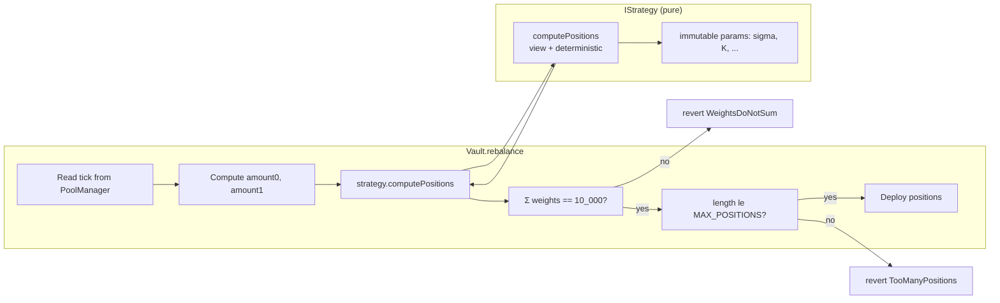

# ADR-005: IStrategy purity contract

## Status

Accepted — 2026-04-29 (revisit by 2026-07-28).

## Context

PRISM's "refraction" — splitting one deposit into N tick-range positions
— is delegated to a pluggable `IStrategy`. The default is `BellStrategy`
(Gaussian weights); future strategies (`OrderBookStrategy`,
`ExponentialStrategy`) ship later.

Whether `IStrategy` may **read vault state** — positions, share supply,
TVL, prior rebalance timestamps, per-user data — has direct consequences
for:

- **Simulation**: pure functions can be fuzzed and replayed offline; a
  strategy that reads vault state cannot.
- **Property testing**: the weight-sum-exactly-10_000 invariant (#2) is
  verifiable per call only when `computePositions` is referentially
  transparent.
- **Strategy hot-swap**: `VaultFactory` can match a `(PoolKey, Strategy)`
  pair predictably; users can compare strategies without simulating each
  inside its target vault context.
- **Audit surface**: a strategy with state pulls vault internals into
  the strategy's mutable boundary; bug in strategy → potential vault
  corruption.

The PRD §Day 3 commits to a pure shape:

```solidity
function computePositions(
    int24 currentTick, int24 tickSpacing,
    uint256 amount0, uint256 amount1
) external view returns (TargetPosition[] memory);

function shouldRebalance(
    int24 currentTick, int24 lastTick, uint256 lastTimestamp
) external view returns (bool);
```

Both functions are `view`, take vault-agnostic primitives, and return
plain data. This ADR formalises that as a hard contract — including how
"purity" is enforced when the language allows `view` functions to call
arbitrary external `view` code.

## Decision

`IStrategy` implementations MUST satisfy these rules:

### Determinism

For any inputs `(tick, tickSpacing, amount0, amount1)`, repeated calls
to `computePositions` MUST return the same `TargetPosition[]`. The
function MUST NOT depend on:

- `block.timestamp`, `block.number`, `block.difficulty`, `blockhash`
- `tx.origin`, `msg.sender`, `gasleft()`
- The vault's storage (no `Vault(...).getX()` calls)
- Any oracle, external feed, or contract whose state can change
- Any `staticcall` to a contract that can be replaced (no
  `IRegistry.lookup(name)` patterns)

Constant inputs from immutable storage on the strategy itself are
permitted — e.g. `BellStrategy` may have `uint256 public immutable
sigma` set at deploy.

### Statelessness

`IStrategy` implementations have **no mutable storage**. All state is
either:

- `immutable` (fixed at deploy), or
- pure constant (`uint256 public constant`).

Concretely, a strategy contract has no SSTOREs after construction. This
is enforceable via Slither (`storage_cleanup`) and via a build-time
check that the deployed bytecode contains no `SSTORE` opcode in the
runtime portion (init code excepted).

### Vault-agnosticism

The strategy MUST NOT take vault address, vault state, or vault-specific
data as input. It receives:

| Input | Source | Why vault-agnostic |
|---|---|---|
| `currentTick` | PoolManager `slot0` | Pool state, not vault state |
| `tickSpacing` | PoolKey | Constant per pool |
| `amount0`, `amount1` | Vault's totals | Numbers, not provenance |

A single deployed `BellStrategy` instance may serve thousands of vaults.
That is the design.

### `shouldRebalance` shape

`shouldRebalance(tick, lastTick, lastTimestamp)` is a pure boolean
function over the same shape — no oracle reads, no historical data
beyond what the vault passes in. Strategy may compare against immutable
thresholds:

```solidity
function shouldRebalance(int24 t, int24 lt, uint256 lts) external view returns (bool) {
    if (block.timestamp - lts > MAX_REBALANCE_INTERVAL) return true; // 24h fallback
    int24 drift = t > lt ? t - lt : lt - t;
    return drift >= driftTrigger; // immutable
}
```

`block.timestamp` is the **only** time-source allowed, and only for the
24h liveness fallback. The deterministic part is the drift comparison.

### Invariant #2 enforcement

Every `IStrategy` implementation MUST return positions with
`Σ position.weight == 10_000` exactly. This is a per-call invariant,
enforced two ways:

1. The strategy's own logic MUST balance rounding errors — typically by
   assigning the rounding remainder to a chosen position (often the
   center). `BellStrategy` does this in its `_normalize` helper.
2. `Vault.rebalance` re-checks the sum after `computePositions` returns
   and reverts with `Errors.WeightsDoNotSum(actual)` if violated. The
   strategy is not trusted to be bug-free — the vault verifies.

### `MAX_POSITIONS` bound

Strategies MUST return at most `MAX_POSITIONS = 30` positions. The vault
enforces this, but strategies should respect it natively to avoid
wasting gas on a guaranteed-revert path.

### Forbidden patterns

| Pattern | Forbidden | Why |
|---|---|---|
| `Vault(vault).positions()` | Yes | Couples strategy to vault state |
| `Oracle(o).price()` | Yes | Non-deterministic across re-simulation |
| `keccak256(abi.encodePacked(block.timestamp))` | Yes | Non-deterministic |
| `delegatecall` from strategy | Yes | Statelessness depends on no shared storage |
| Storing user-specific data | Yes | Statelessness violation |
| Reading `tx.gasprice` | Yes | Determinism violation |
| Calling another `view` strategy | Allowed if target is also pure | Composition is fine if both are pure |

## Alternatives considered

### A. Strategy with vault read access (rejected)

Pass `address(vault)` and let the strategy `staticcall` whatever it
wants. Enables strategies that adjust to current TVL, position health,
fee accrual, etc.

Rejected:

- Strategy could simulate vault math and "predict" rebalance outcomes,
  potentially encoding admin-like behaviors.
- Reentrancy concern: strategy reads vault during `unlockCallback`,
  vault state mid-operation may be inconsistent — purity is violated by
  necessity inside the unlock window.
- Audit complexity: strategy + vault become entangled.
- Property testing breaks: `computePositions(...)` no longer has stable
  output even for fixed inputs, because vault state isn't part of the
  input.

### B. Stateful strategy with EIP-1153 transient state (rejected)

Allow strategies to use transient storage during a single `unlock` for
multi-step intermediate computation.

Rejected for v1.0:

- Saves no real gas vs. memory variables in a single function.
- Adds complexity to the audit story without a concrete use case.
- Could be revisited in v1.1 if a strategy proves the need.

### C. Off-chain strategy with on-chain verification (rejected)

Strategy returns a Merkle proof of its computation; on-chain verifies.

Rejected: latency on rebalance triggers (signed payload fetch +
verification > on-chain compute), and the verifier is itself code that
must be audited. The on-chain pure path is faster *and* simpler. Worth
revisiting only if `BellStrategy` math becomes intractable on-chain
(no current evidence).

## Invariants impacted

- **#2 — Σ position.weight == 10_000.** Vault re-checks after every
  `computePositions`. Purity guarantees the same input gives the same
  weights every time, so a fuzz harness can prove the property
  exhaustively offline.
- **#3 — `positions.length <= MAX_POSITIONS`.** Vault checks; strategy
  pre-checks for gas hygiene.
- **#6 — `sharePrice(t+1) >= sharePrice(t)` under normal operation.**
  Pure strategies make this provable per-call given fixed inputs.

## Architecture



## Testing guidance

Purity is enforced by three complementary mechanisms:

1. **Compile-time** — interface declares `view`; `external view` plus a
   no-state-vars contract is the canonical shape.
2. **Build-time** — Slither rule against state-changing operations and
   block-time / origin reads in strategy contracts.
3. **Property fuzz** — for every strategy, a Foundry test that calls
   `computePositions` twice with identical inputs and asserts equal
   output (struct-equal). And one that calls with random inputs and
   asserts `Σ weight == 10_000` and `length <= MAX_POSITIONS`.
4. **Bytecode check** — `forge build` + a script that scans the
   strategy's runtime bytecode for `SSTORE` (0x55) opcode. Fails CI if
   present.

## Consequences

**Positive**

- Strategies can be simulated, fuzzed, and reasoned about in isolation.
- Strategy swap is a pure choice — no migration, no shared mutable
  state.
- Audit cost per strategy is small and bounded — pure math contracts.
- Same strategy instance shared across vaults reduces deploy gas.

**Negative**

- Strategies cannot react to current vault TVL distribution, position
  health, or recent activity — all such adaptation must happen at the
  *vault* level (e.g. by the keeper choosing rebalance timing). This is
  by design but limits some strategy types (e.g. "concentrate when
  everyone else is also concentrated"). v1.1 may revisit if such a
  strategy proves valuable.
- Time-based rebalance is the only allowed time dependency, and only
  for the 24h liveness fallback. Strategies cannot encode "rebalance
  every Friday" or "rebalance after volatility spike" — those belong in
  the keeper or in the hook's volatility state, not in the strategy.

**Neutral**

- Strategy interface stays small and stable. Adding new methods would
  fork the purity contract; we will not.

## References

- Issue ozpool/prism#12 (this ADR)
- PRD §Day 3 — IStrategy interface and BellStrategy
- PRD invariants 2, 3, 6
- ADR-002 — Singleton hook (orthogonal but shares the "stateless math
  near the user fund path" philosophy)
- ADR-004 — Flash accounting (vault calls strategy from inside unlock)
