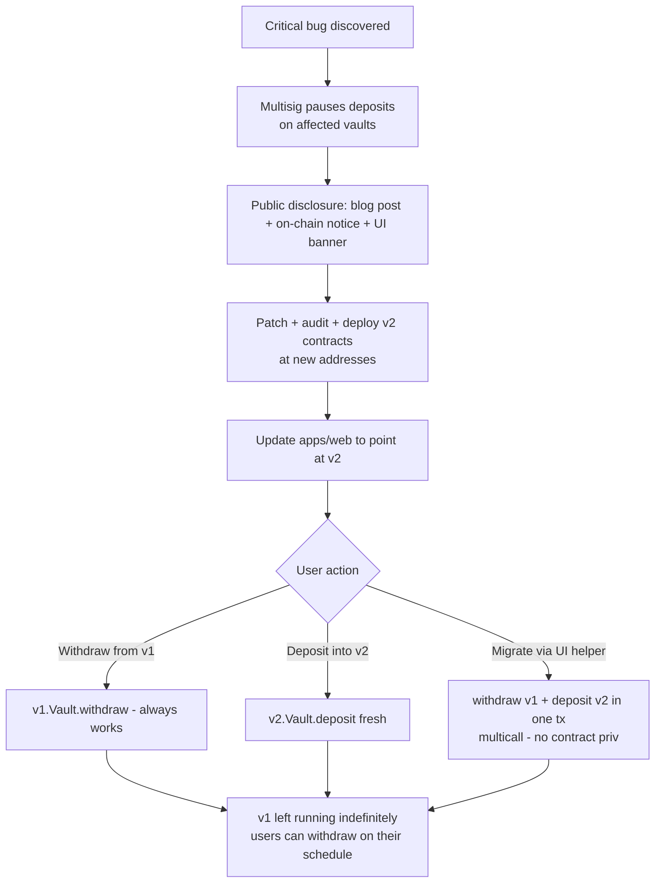

# ADR-006: Immutable core v1

## Status

Accepted — 2026-04-29 (revisit by 2026-07-28).

## Context

PRISM v1 ships with no upgrade proxies on `Vault`, `VaultFactory`,
`ProtocolHook`, `BellStrategy`, `ChainlinkAdapter`, or any other core
contract. The PRD §1 Design Philosophy frames this as
*governance-is-attack-surface in exchange for upfront rigor*. Earlier
ADRs lean on the assumption — ADR-002's hook bug-fix path, ADR-003's
v1.1 oracle migration, ADR-004's vault binding to a specific
`PoolManager` — all assume "redeploy + migrate", not "upgrade in place".

This ADR is the load-bearing commitment those ADRs cite. It must:

1. State the no-proxy policy unambiguously.
2. Reaffirm "withdrawals never pausable" (PRD invariant 6).
3. Define the **migration playbook** for the only scenario where v1
   contracts must be retired: a critical bug requiring code change.
4. Cap the legitimate admin surface (deposit pause, fee cap, TVL cap)
   so we don't accidentally re-introduce governance through the back
   door.

The acceptance criteria on #11 explicitly require the
withdrawals-never-pausable guarantee to be reaffirmed and a
communication template for the critical-bug scenario.

## Decision

### 1. No upgrade proxies

The following contracts are deployed once and **never upgraded**:

- `Vault` (one per `(PoolKey, Strategy)`)
- `VaultFactory`
- `ProtocolHook`
- `BellStrategy` and any future `IStrategy` implementations
- `ChainlinkAdapter` (and `PythAdapter` when added)
- `Errors`, `PositionLib`, `FeeLib`, `MEVLib`, `HookMiner`,
  `ReentrancyGuardTransient` (libraries — immutable by virtue of being
  libraries, but explicitly listed)

No contract MAY use:

- OpenZeppelin `TransparentUpgradeableProxy`, `UUPS`, `Beacon`
- `delegatecall` to a settable target
- A "logic contract pointer" pattern under any name

`delegatecall` is permitted only to vendored, immutable libraries (the
EVM `DELEGATECALL` opcode within Solidity's `using for` and library
function-call patterns), where the target is fixed at compile time.

### 2. Withdrawals never pausable (reaffirmed)

`Vault.withdraw` MUST remain callable by any holder of vault shares
under all circumstances. This is invariant 6 (PRD §13.2). Concretely:

- No `whenNotPaused` modifier on `withdraw`.
- No oracle dependency on `withdraw` (ADR-003 boundary).
- No strategy dependency on `withdraw` (the strategy is consulted on
  rebalance only).
- No hook callback that can revert during `afterRemoveLiquidity`
  (ADR-002 hard rule).

A contract that violates any of the above fails CI (architecture test
suite, `test/architecture/InvariantWithdrawNotPausable.t.sol`).

### 3. Permitted admin surface

PRISM v1 has exactly **two** admin levers, both bounded:

| Lever | Authority | Bound |
|---|---|---|
| `Vault.pauseDeposits()` | Multisig (3-of-5) | 48h timelock to enable; instant disable. Cannot affect withdraw or rebalance. |
| `VaultFactory.setTvlCap(vault, cap)` | Multisig (3-of-5) | Per-vault uint128. Cannot set below current TVL. Soft cap = blocks new deposits, not redemptions. |

The multisig has **no other authority**. It cannot:

- Pause withdraw or rebalance.
- Sweep tokens from any contract.
- Mint, burn, or transfer shares on behalf of users.
- Change fees, strategy parameters, or oracle adapters.
- Replace the hook or `PoolManager` address.
- Upgrade or migrate any contract.

This is enforced by code review and by absence of admin-gated functions
in the deployed bytecode. A test in `test/architecture/AdminSurface.t.sol`
asserts no contract has more than these two `onlyOwner`-equivalent
functions.

### 4. Migration playbook (critical bug)

When a critical bug is discovered in a deployed contract, the response
is **deploy + redirect**, not upgrade:



Concretely:

1. **Immediate (T+0h)**: multisig calls `pauseDeposits` on every affected
   vault. Withdraws and rebalance remain enabled. UI banner +
   on-chain `EmergencyNotice` event published.
2. **Disclosure (T+24h)**: blog post on the project site, mirrored on
   GitHub `SECURITY.md`. Specifies the bug class, affected versions,
   recommended user action.
3. **v2 deploy (T+ days–weeks)**: patch, re-audit, deploy v2 contracts
   at new addresses (new `VaultFactory`, fresh hook salt-mining if hook
   is affected). v2 vaults have no automatic relationship to v1 — they
   are entirely separate deployments.
4. **UI migration**: `apps/web` adds a v2 toggle, then defaults to v2.
   v1 vault pages remain reachable for withdraws indefinitely. We do
   not artificially deprecate v1 from the UI — users should be able to
   exit on their own schedule.
5. **Migration helper (optional)**: a stateless multicall contract that
   takes shares of v1, withdraws, deposits into v2 — all in one tx, all
   user-signed. The contract has no privileges; it is a convenience
   layer. Users may also do it manually.
6. **Long tail**: v1 vaults are never destroyed. The withdraw path
   continues to work as long as the PoolManager and the vault's
   liquidity exist. We accept supporting the long tail forever as the
   cost of immutability.

### 5. Communication template (critical-bug)

```
Subject: PRISM Security Notice — <YYYY-MM-DD>

A [critical|high] severity issue affecting <vault name(s)> has been
identified in <contract name>. We have:

1. Paused new deposits on affected vaults at <block #>.
2. Confirmed withdrawals remain functional for all share holders.
3. Notified the multisig and engaged <auditor> for verification.

What you should do:
- If you have funds in <affected vaults>, you may withdraw at any time
  via <UI URL> or directly via Etherscan write-contract.
- A patched v2 will be deployed at a new address once verified. We will
  publish the v2 address here and on the @prism handle.
- We will NOT contact you privately or ask for your private key. Any
  message claiming to be PRISM staff with a different recovery flow is
  a phishing attempt.

Technical details: <link to GitHub disclosure>
Auditor confirmation: <link>
v2 deploy ETA: <date or "TBD pending audit">
```

## Alternatives considered

### A. UUPS or Transparent Proxy with timelocked admin (rejected)

Standard upgrade proxy pattern with a 7-day timelock on upgrades.

Rejected:

- Adds a permanent admin slot that *will* be the target of governance
  attacks, key compromise, or social engineering. The historical record
  on this is clear (see e.g. dForce 2020, Audius 2022, multiple
  governance-attack post-mortems).
- Storage layout migration is a known footgun even with the timelock —
  one bad slot in a v2 implementation bricks the proxy.
- Audit cost for the proxy + every implementation is meaningful.
- The "fix bugs faster" argument is real but, given PRISM's withdraw
  guarantee, every bug except a "withdraw is broken" bug can be handled
  via the redeploy path *while users hold their funds*. A "withdraw is
  broken" bug would require an immediate proxy upgrade — but if
  withdraw is broken, attackers may already have moved.

### B. Beacon proxy with hard-capped admin (rejected)

Same reasons as A; one admin slot per beacon multiplies the attack
surface across vaults.

### C. Forwarder / "trusted Diamond facet" (rejected)

Diamond pattern (EIP-2535) with admin-controlled facet replacement.
Same governance-as-attack-surface critique. Higher audit cost than
UUPS.

### D. No proxy + rebalance-only "soft upgrade" via strategy swap (considered, partial accept)

`VaultFactory.create(PoolKey, Strategy)` allows users to switch
strategies by depositing into a fresh vault. This is in scope as a
*UX* feature for strategy choice, not a "soft upgrade" — the vault
contract itself is still immutable. We accept this as the canonical
"upgrade for strategy logic only" path.

## Invariants impacted

- **Invariant 6 — Withdrawals never pausable.** Reaffirmed and
  CI-tested.
- **All 7 protocol invariants.** Immutability means each invariant has
  a single, frozen implementation that is the audit subject. Any
  invariant violation requires a v2 deploy.

## Consequences

**Positive**

- Zero governance attack surface against user funds. The multisig can
  block new deposits, full stop.
- Audit scope is finite and stable — no upgrade hatch, no facet
  registry, no implementation pointer.
- User trust posture: "your funds are not behind a key holder, ever."
- ADR-002 (hook redeploy) and ADR-003 (oracle redeploy) and ADR-004
  (PoolManager binding) all rest on this commitment cleanly.

**Negative**

- Bug fixes are slower and noisier than an in-place upgrade. We accept
  this; the withdraw guarantee bounds the worst-case impact.
- Storage in v1 vaults is stranded if v2 introduces a different layout
  — users must withdraw and redeposit. There is no automatic migration.
- Long-tail support cost: v1 contracts must be observable / debuggable
  for as long as TVL remains. We commit to this for at least the audit
  remediation period (12 months minimum).

**Neutral**

- The two-lever admin surface (deposit pause, TVL cap) is a small,
  named, bounded mutability — not a violation of "immutable core" but
  worth being explicit about.

## References

- Issue ozpool/prism#11 (this ADR)
- PRD §1 Design Philosophy ("Immutable Core")
- PRD §13 Risk — Figure 13.1 (immutable contracts as risk control)
- ADR-002 — Hook scoping (cites this ADR for migration path)
- ADR-003 — Oracle strategy (cites this ADR for v1.1 adapter swap)
- ADR-004 — Flash accounting (vault binds PoolManager immutably)
- ADR-005 — Strategy purity (immutable params on strategies)
